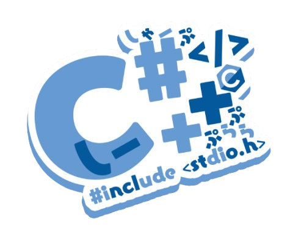

# Introduction
**Welcome Agent (or Civilian).**\
Documentation for the ever growing API with top-tier security & functionality in-mind.\
**Developed With:**

<h2 style="text-align:center; font-size:32px;">Interstellar</h2>

   

---

## Usage

All API functions are kept under one shared table that only you can access.\
This is simply done by accessing `secret.*` a variable accessible only to your environment.\
We designed it such that the only caveat of an enviornment leak, is the user themselves.\
We trust that **YOU**, won't do something like `_G.<api> = <api>` putting yourself at risk (all though, up to you).

By design the API generated by the engine is only done when you execute something.\
Your API therefore does not exist in memory until execution or compilation is perform.\
This is for your safety if a malicious actor some-how has abilities to grab the API.

---

## Trust & Safety

This API is designed for the benefit of the user having more control over their environments.\
However due to the nature of this system, the following is prohibited:
- Obfuscation **(Minifiers Excluded)**
- User Data Collection & Extraction
- Exposure of Confidential & Personal information

Violating these may result in account limitations or terminations.\
If there is a safety issue that needs attention please contact an administrator or developer.

---

<i><b>Game Engine Support</b></i>

Game Engine | Support Status {.compact}
--- | ---
**GMOD** | **Supported**
**CS2** | **Planned-Locked**

Help, Help, Help, Help, Help, AAAAAAAAAAAAAA

